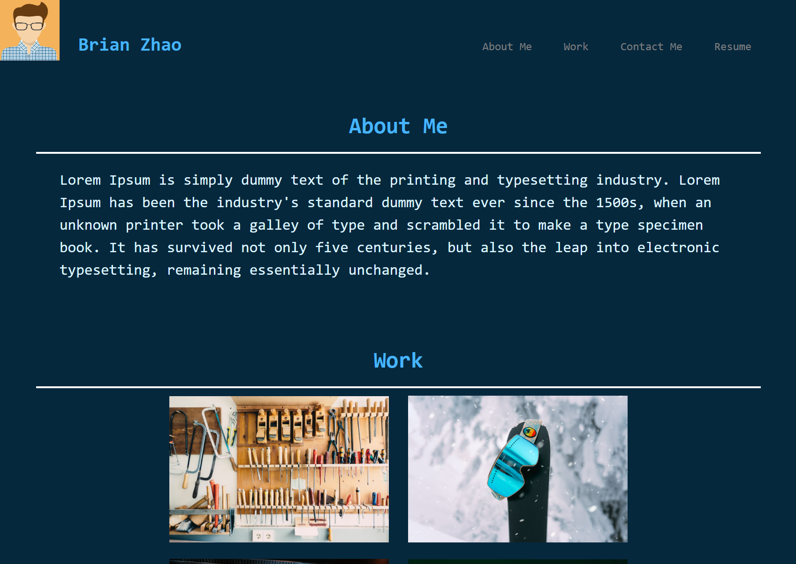

# ** 02 Advanced CSS: Portfolio **

## Description

This is second challenge for the Berkeley boot camp. It requires students to create a portfolio page using html and CSS skills were learned from the pass week. Skills includes flexbox, media queries, and CSS variables. 

This portfolio page challenge asks a page that has developer's name, recent photo or avatar, and links to different sections about them, their work or how to contact them. 

This is a link for the deployed application here.
https://byxzesc.github.io/Profession-Portfolio/

And this is the repo that contains my code.
https://github.com/byxzESC/Profession-Portfolio

## Webpage preview

## Credits

I have to thank all the classmate that helped me with CSS flexbox and ideas on html classes formatting during study-groups sessions. 